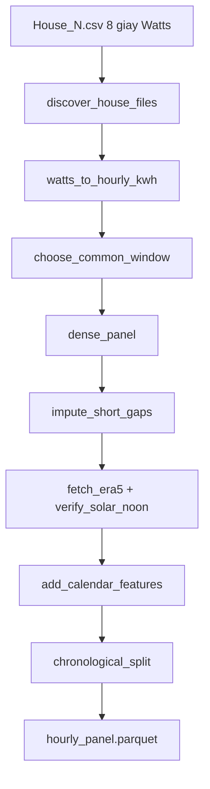

# Kiến trúc tổng

## Hai giai đoạn

```text
Giai đoạn A — build panel (một lần)
  House_*.csv
    -> hourly kWh + mask
    -> common window
    -> Open-Meteo
    -> calendar
    -> split 70/15/15
    -> data/processed/hourly_panel.parquet

Giai đoạn B — experiment (nhiều lần, đọc parquet)
  YAML experiment
    -> cửa sổ 168/24
    -> scaler train-only
    -> model
    -> metrics trên giờ observed
    -> experiments/results/experiment_log.csv
```

Tách hai giai đoạn vì file 8 giây nặng (~300–400 MB/nhà). Không đọc raw mỗi lần train.

## Luồng chi tiết giai đoạn A



Hàm điều phối: `src/data/pipeline.py` → `build_hourly_panel()`.
Script gọi nó: `scripts/build_panel.py`.

## Map thư mục

| Thư mục | Việc của nó | Không làm gì |
|---------|-------------|--------------|
| `configs/` | Mọi số thí nghiệm (horizon, weather set, seed) | Không chứa logic |
| `src/data/` | Từ CSV thô tới cửa sổ tensor | Không train |
| `src/weather/` | ERA5 + cache + check noon | Không dự báo thời tiết riêng |
| `src/graphs/` | Ma trận kề | Chưa gắn vào model (GNN còn stub) |
| `src/models/` | Kiến trúc mạng / baseline | Không đọc file, không tính MAE |
| `src/train/` | Vòng lặp, seed, log | Không định nghĩa metric |
| `src/eval/` | MAE/WAPE, plot, Wilcoxon | Không update trọng số |
| `scripts/` | Điểm vào CLI | Mỏng: import `src` |
| `notebooks/` | Hiện kết quả | Cấm nhét model vào cell |
| `tests/` | Leak, mask, House 14, scaler | Không thay cho experiment REFIT |
| `docs/hieu-source/` | Đọc hiểu (thư mục này) | Không phải paper |

## File "não" nên mở trước

1. `src/data/pipeline.py` — thứ tự bước thật.
2. `DATA_LEAKAGE.md` — luật khoa học.
3. `src/models/lstm.py` + `src/train/lstm_run.py` — model đã implement.
4. `configs/data.yaml` + `configs/experiment/*.yaml` — thí nghiệm là file, không phải flag rải rác.

## Nguyên tắc thiết kế xuyên suốt

- **Config-driven.** Đổi thí nghiệm = đổi YAML. Reviewer so được hai run bằng diff file.
- **Notebook mỏng.** Logic nằm trong `src/` để Kaggle và máy local gọi cùng một hàm.
- **Comment giải thích vì sao**, không kể lại vòng for. Chỗ bắt buộc comment: DST/UTC, mask vs impute, graph train-only.
- **Một nhà = một node.** Cột appliance chỉ để EDA, không vào GNN.
